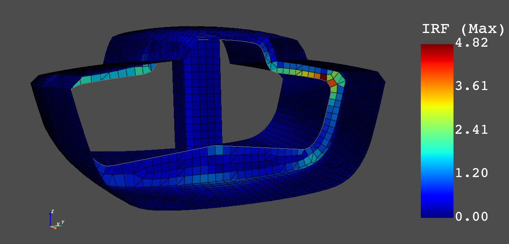

Use of gRPC Server instead of Docker Container
==============================================

This example demonstrates the use of pyACP in combination with the gRPC sever instead
of the Docker container. The gRPC server of ACP is delivered with the unified installer.
It can be beneficial to work with the gRPC server if the data is already stored locally
or to reduce the latency between the server and client.

In this example, pyACP is used to add a lay-up to a MAPDL model (CDB file)
which already contains the material properties, boundary conditions and solution settings.
The MAPDL model with lay-up definition is solved with pyMAPDL.
Finally, the result is post-processed with pyDPF Composites to run a composite failure analysis.

The first step is to specify the license server and the version of the unified installer.
These environment variables are used within the Python script and by the gRPC servers
(ACP, MAPDL and DPF) for the license checkout.

.. code-block:: bash

    set ANSYS_VERSION=231
    set ANSYSLMD_LICENSE_FILE=1055@my_license_server

Ensure that the required Python modules (ansys-acp-core, ansys-dpf-core, ansys-dpf-composites
and ansys-mapdl) are installed before launching Python.

.. code-block:: python

    import os
    import pathlib
    import tempfile
    import numpy as np
    import grpc

    ANSYS_VERSION = os.environ["ANSYS_VERSION"]
    AWP_ROOT_KEY = f"AWP_ROOT{ANSYS_VERSION}"

    acp_grpc_exe = os.path.join(os.environ[AWP_ROOT_KEY], "ACP", "acp_grpcserver.exe")

    # Launch gRPC server and pyACP client
    import ansys.acp.core as pyacp
    pyacp_server = pyacp.launch_acp(binary_path=acp_grpc_exe, port=50555, stdout_file="pyacp.log", stderr_file="pyacp.err")
    pyacp.wait_for_server(pyacp_server, timeout=30)  # ensure the server is running
    pyacp_client = pyacp.Client(pyacp_server)

    """
    Modelling of The Composite Lay-up with pyACP
    """

    # Import the model from MAPDL input file (CDB)
    # Note: the unit system is required for the post-processing
    CDB_FILENAME = "class40.cdb"
    model = pyacp_client.import_model(path=CDB_FILENAME,
        format="ansys:cdb",
        unit_system=pyacp.UnitSystemType.MPA
    )
    model

    # Configure the materials.
    # The ply type is required to run the failure analysis with dpf composites
    mat_corecell_81kg = model.materials["1"]
    mat_corecell_81kg.name = "Core Cell 81kg"
    mat_corecell_81kg.ply_type = "isotropic_homogeneous_core"

    mat_corecell_103kg = model.materials["2"]
    mat_corecell_103kg.name = "Core Cell 103kg"
    mat_corecell_103kg.ply_type = "isotropic_homogeneous_core"

    mat_eglass_ud = model.materials["3"]
    mat_eglass_ud.name = "E-Glass (uni-directional)"
    mat_eglass_ud.ply_type = "regular"

    # Create Fabrics
    corecell_81kg_5mm = model.create_fabric(
        name="Corecell 81kg", thickness=0.005, material=mat_corecell_81kg
    )
    corecell_103kg_10mm = model.create_fabric(
        name="Corecell 103kg", thickness=0.01, material=mat_corecell_103kg
    )
    eglass_ud_02mm = model.create_fabric(name="eglass UD", thickness=0.0002, material=mat_eglass_ud)

    # Specify rosettes (coordinate systems)
    ros_deck = model.create_rosette(name="ros_deck", origin=(-5.9334, -0.0481, 1.693))
    ros_hull = model.create_rosette(name="ros_hull", origin=(-5.3711, -0.0506, -0.2551))
    ros_bulkhead = model.create_rosette(
        name="ros_bulkhead", origin=(-5.622, 0.0022, 0.0847), dir1=(0.0, 1.0, 0.0), dir2=(0.0, 0.0, 1.0)
    )
    ros_keeltower = model.create_rosette(
        name="ros_keeltower", origin=(-6.0699, -0.0502, 0.623), dir1=(0.0, 0.0, 1.0)
    )

    # Add Oriented Selection Sets
    oss_deck = model.create_oriented_selection_set(
        name="oss_deck",
        orientation_point=(-5.3806, -0.0016, 1.6449),
        orientation_direction=(0.0, 0.0, -1.0),
        element_sets=[model.element_sets["DECK"]],
        rosettes=[ros_deck],
    )

    oss_hull = model.create_oriented_selection_set(
        name="oss_hull",
        orientation_point=(-5.12, 0.1949, -0.2487),
        orientation_direction=(0.0, 0.0, 1.0),
        element_sets=[model.element_sets["HULL_ALL"]],
        rosettes=[ros_hull],
    )

    oss_bulkhead = model.create_oriented_selection_set(
        name="oss_bulkhead",
        orientation_point=(-5.622, -0.0465, -0.094),
        orientation_direction=(1.0, 0.0, 0.0),
        element_sets=[model.element_sets["BULKHEAD_ALL"]],
        rosettes=[ros_bulkhead],
    )

    esets = [
        model.element_sets["KEELTOWER_AFT"],
        model.element_sets["KEELTOWER_FRONT"],
        model.element_sets["KEELTOWER_PORT"],
        model.element_sets["KEELTOWER_STB"],
    ]

    oss_keeltower = model.create_oriented_selection_set(
        name="oss_keeltower",
        orientation_point=(-6.1019, 0.0001, 1.162),
        orientation_direction=(-1.0, 0.0, 0.0),
        element_sets=esets,
        rosettes=[ros_keeltower],
    )

    # Add plies to all parts
    def add_ply(mg, name, ply_material, angle, oss):
        return mg.create_modeling_ply(
            name=name,
            ply_material=ply_material,
            oriented_selection_sets=oss,
            ply_angle=angle,
            number_of_layers=1,
            global_ply_nr=0,  # add at the end
        )

    angles = [-90.0, -60.0, -45.0 - 30.0, 0.0, 0.0, 30.0, 45.0, 60.0, 90.0]
    for mg_name in ["hull", "deck", "bulkhead"]:
        mg = model.create_modeling_group(name=mg_name)
        oss_list = [model.oriented_selection_sets["oss_" + mg_name]]
        for angle in angles:
            add_ply(mg, "eglass_ud_02mm_" + str(angle), eglass_ud_02mm, angle, oss_list)
        add_ply(mg, "corecell_103kg_10mm", corecell_103kg_10mm, 0.0, oss_list)
        for angle in angles:
            add_ply(mg, "eglass_ud_02mm_" + str(angle), eglass_ud_02mm, angle, oss_list)

    mg = model.create_modeling_group(name="keeltower")
    oss_list = [model.oriented_selection_sets["oss_keeltower"]]
    for angle in angles:
        add_ply(mg, "eglass_ud_02mm_" + str(angle), eglass_ud_02mm, angle, oss_list)

    add_ply(mg, "corecell_81kg_5mm", corecell_81kg_5mm, 0.0, oss_list)

    for angle in angles:
        add_ply(mg, "eglass_ud_02mm_" + str(angle), eglass_ud_02mm, angle, oss_list)

    # Update the lay-up model
    model.update()

    # Store ACP model and generate the output for MAPDL and the post-processing with DPF
    os.mkdir("tmp")
    WORKDIR = os.path.join(os.path.abspath("."), "tmp")
    ACPH5_FILE = os.path.join(WORKDIR, "class40.acph5")
    CDB_FILENAME_OUT = os.path.join(WORKDIR, "class40_analysis_model.cdb")
    COMPOSITE_DEFINITIONS_H5 = os.path.join(WORKDIR, "ACPCompositeDefinitions.h5")
    MATML_FILE = os.path.join(WORKDIR, "materials.xml")

    # Store ACP DB
    model.save(ACPH5_FILE, save_cache=True)

    # Input files for MAPDL and DPF
    model.save_analysis_model(CDB_FILENAME_OUT)
    model.export_shell_composite_definitions(COMPOSITE_DEFINITIONS_H5)
    model.export_materials(MATML_FILE)

    """
    Solve Model with Composite efinitions with pyMAPDL
    """

    # Launch MAPDL
    from ansys.mapdl.core import launch_mapdl
    mapdl = launch_mapdl()
    # Load the CDB file with the composite lay-up
    mapdl.input(CDB_FILENAME_OUT)

    # Solve and show deformations
    mapdl.allsel()
    mapdl.slashsolu()
    mapdl.solve()

    mapdl.post1()
    mapdl.set("last")
    mapdl.post_processing.plot_nodal_displacement(component="NORM")

    Total deformations (usum)

.. code-block:: python

    """
    Run Failure Analysis with DPF Composites
    """

    # Import post-processing module (ansys-dpf-composites)
    from ansys.dpf.composites.failure_criteria import (
        CombinedFailureCriterion,
        MaxStrainCriterion,
        MaxStressCriterion,
        CoreFailureCriterion
    )
    from ansys.dpf.composites import ResultDefinition
    from ansys.dpf.composites.load_plugin import load_composites_plugin
    import ansys.dpf.core as dpf

    # Launch local gRPC server of dpf and connect to
    dpf_server = dpf.start_local_server(ansys_path=os.environ[AWP_ROOT_KEY])
    base = dpf.BaseService(server=dpf_server, load_operators=False)
    base.load_library("Ans.Dpf.EngineeringData.dll", "EngineeringData")
    composites_plugin_path = os.path.join(os.environ[AWP_ROOT_KEY], "dpf", "plugins", "dpf_composites", "composite_operators.dll")
    base.load_library(composites_plugin_path, "Composites")

    # Configure failure criteria
    max_strain = MaxStrainCriterion()
    max_stress = MaxStressCriterion()
    core_failure = CoreFailureCriterion()

    cfc = CombinedFailureCriterion(
        name="Combined Failure Criterion",
        failure_criteria=[max_strain, max_stress, core_failure]
    )

    rstfile_path = os.path.join(mapdl.directory, f"{mapdl.jobname}.rst")

    rd = ResultDefinition(
        name="combined failure criteria",
        rst_files=[rstfile_path],
        material_files=[MATML_FILE],
        composite_definitions=[COMPOSITE_DEFINITIONS_H5],
        combined_failure_criterion=cfc,
    )

    # Configure and run DPF failure operator
    fc_op = dpf.Operator("composite::composite_failure_operator")
    elements = list([int(v) for v in np.arange(1,3996)])
    rd.element_scope=elements
    fc_op.inputs.result_definition(rd.to_json())
    output_all_elements = fc_op.outputs.fields_containerMax()

    failure_value_index = 1
    failure_mode_index = 0

    # Plot inverse reserve factors
    irf_field = output_all_elements[failure_value_index]
    irf_field.plot()

    Maximum inverse reserve factor of each element